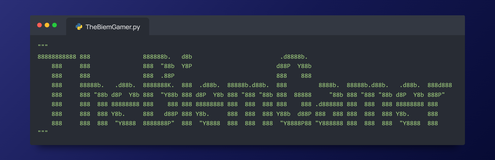

    

<h1 align="center">
    Hey 👋 What's up?
</h1>

    My name is Noah, and I'm an ICT Student at <a href="https://www.internationalhu.com">University of Applied Sciences Utrecht</a>. I'm from the Netherlands 🇳🇱.

 

<h1 align="center">
    👓 About me
</h1>

<ul>
    <li>Creating bugs since 2019.</li>
    <li>I'm currently learning Python.</li>
    <li>Goals: finishing my studies.</li>
    <li>Fun fact: <a href="https://www.wired.com/story/physics-explains-why-you-cant-open-a-plane-door-mid-flight/">it's nearly impossible to open an airplane door when at cruising altitude, because of the difference in air pressure</a>.</li>
</ul>

 

<h1 align="center">
    💻 Tech Stack
</h1>

    

 

<h1 align="center">
    📦 Projects
</h1>

    <table>
        <thead>
            <tr>
            <th>Name</th>
            <th>Summary</th>
            <th>Install</th>
            </tr>
        </thead>
        <tbody>
            <tr>
            <td><a href="https://thebiemgamer.github.io/The-Hangman-Wordlist/">The Hangman Wordlist</a></td>
            <td>A small Python module which returns hangman words.</td>
            <td></td>
            </tr>
            <tr>
            <td><a href="https://thebiemgamer.github.io/Json-File-Helper/">JSON File Helper</a></td>
            <td>A class for easier JSON File usage in Python.</td>
            <td></td>
            </tr>
            <tr>
            <td><a href="https://github.com/TheBiemGamer/WhoIsApi">WhoIs Api</a></td>
            <td>A WhoIs API and frontend written in Python, HTML, CSS and JavaScript.</td>
            <td></td>
            </tr>
        </tbody>
    </table>

 

<h1 align="center">
    ✍️ Random Dev Quote
</h1>

    

