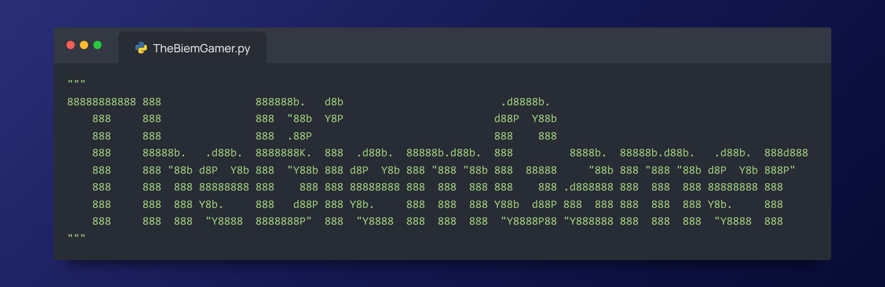

###

<h1 align="left">Hey 👋 What's up?</h1>

###

My name is Noah and I'm a ICT Student at <a href="https://www.internationalhu.com">University of Applied Sciences Utrecht</a>, I'm from the Netherlands.
 

###

<h2 align="left">About me</h2>

###

✨ Creating bugs since 2019. 📚 I'm currently learning Python. 🎯 Goals: finishing my studies. 🎲 Fun fact: <a href="https://www.wired.com/story/physics-explains-why-you-cant-open-a-plane-door-mid-flight/">it's nearly impossible to open an airplane door when at cruising altitude, because of the difference in air pressure</a>.

###

<h2 align="left">I code with</h2>

###

  
  
  
  
  
  
  
  
  

###

<h2 align="left">Projects I'm working on</h2>

###

- [TheHangmanWordlist](https://thebiemgamer.github.io/TheHangmanWordlist/)
